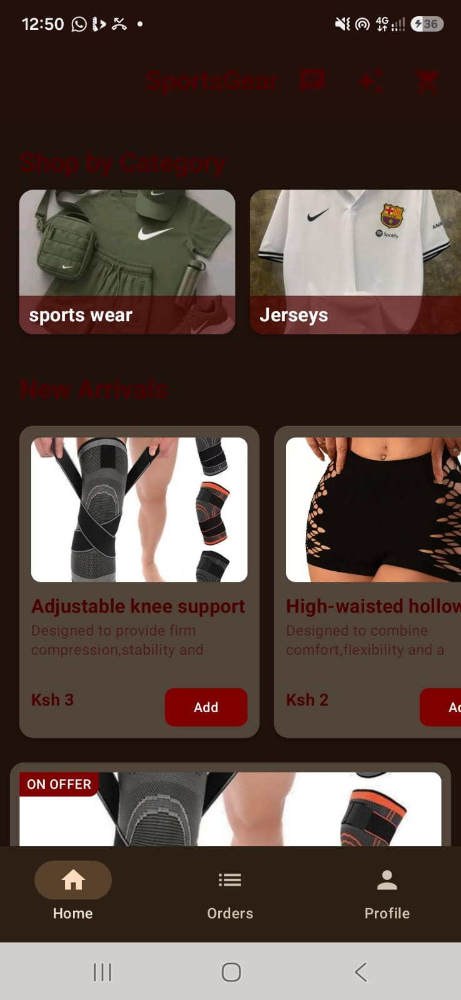
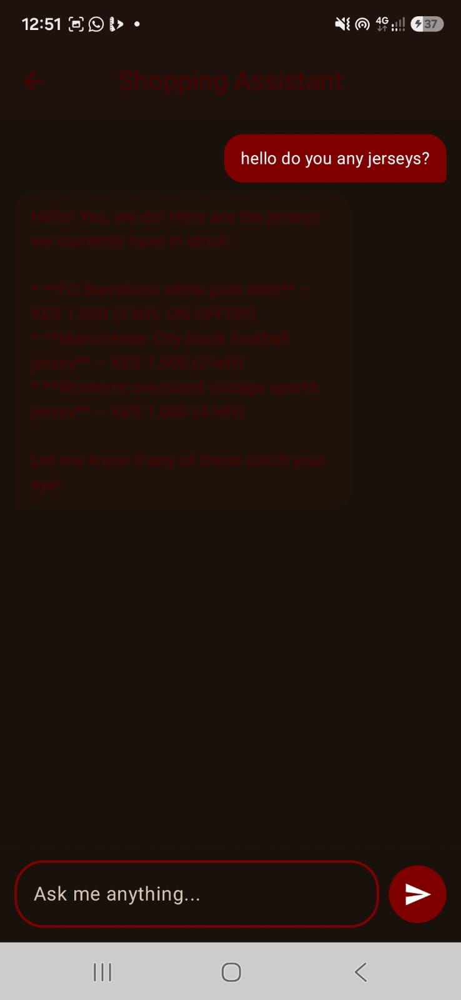
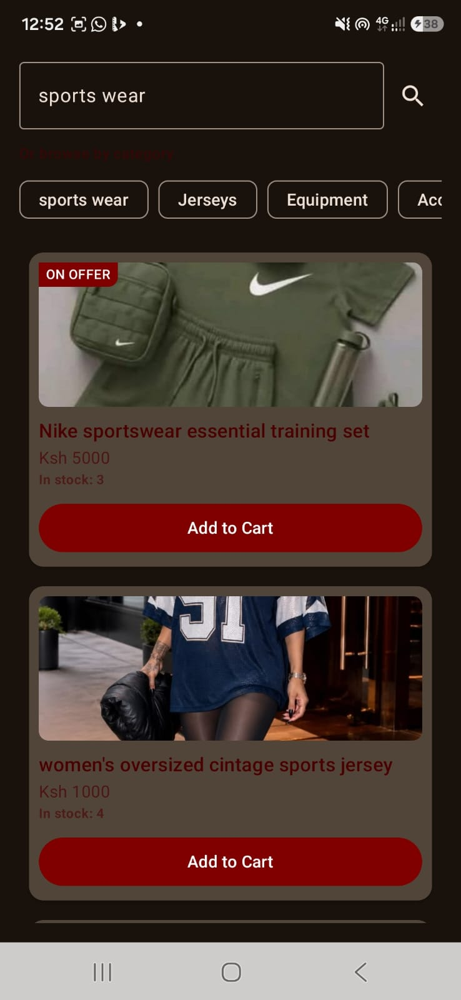

# SportsGear — Android E-Commerce App with AI Features

A full-featured sports-gear e-commerce Android app built with Jetpack Compose
and Firebase, featuring three AI-powered capabilities built on Firebase AI
Logic (Gemini).

## Features

### Core E-Commerce
- Firebase Authentication (user & admin roles)
- Product catalog with categories, offers, and stock tracking
- Cart management with live quantity sync
- Mpesa payment integration
- Order history and admin order management
- Admin dashboard for product CRUD operations
- Firebase Realtime Database with role-based security rules

### AI-Powered Features
- **AI Shopping Assistant** — conversational chat that answers questions
  about products using live stock and pricing data, never guessing numbers
- **Smart Search** — semantic natural-language search (e.g. "cheap running
  shoes under 3000") that understands intent, synonyms, and budget
- **AI Product Addition** — admin picks a product photo and Gemini suggests
  a name, description, category, and price, which the admin reviews before
  saving

## Tech Stack
- Kotlin, Jetpack Compose, Material 3
- Firebase Authentication, Realtime Database, App Check
- Firebase AI Logic (Gemini Developer API — gemini-flash-latest,
  gemini-flash-lite-latest)
- Retrofit + OkHttp (Mpesa integration, Imgur image hosting)
- Coroutines, StateFlow, Navigation Compose

## Architecture Notes
- Shared ViewModels (CartViewModel, AuthViewModel) are instantiated once
  in AppNavHost and passed down, avoiding duplicate Firebase listeners
- AI features use a context-injection pattern rather than function calling,
  after hitting SDK-level role-compatibility issues with function responses
  in the current firebase-ai release
- All AI calls include retry logic with backoff for rate-limit/overload
  handling on the Gemini free tier

## Known Limitations (honest, for reviewers)
- Image hosting via Imgur (not Firebase Storage) — fine for a demo, not
  production-hardened
- Gemini free tier caps at 20 requests/minute — sufficient for development,
  would need a billing account for real production traffic
- Product.quantity is stored as a String for historical reasons; parsed
  with .toIntOrNull() throughout
- No automated test suite yet

## Setup
1. Clone the repo
2. Add your own google-services.json to app/
3. Add Mpesa credentials to local.properties (see MPESA_* fields in
   app/build.gradle.kts)
4. Enable Firebase AI Logic (Gemini Developer API) in your Firebase Console
5. Enable Firebase App Check and register a debug token for local development

## Screenshots
📱 Screenshots

  
  
  

  <em>Home Screen &nbsp;•&nbsp; AI Shopping Assistant &nbsp;•&nbsp; Smart Search</em>

